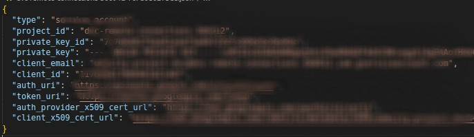
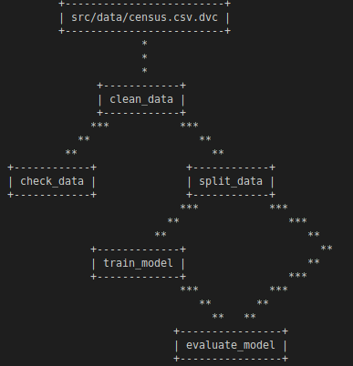
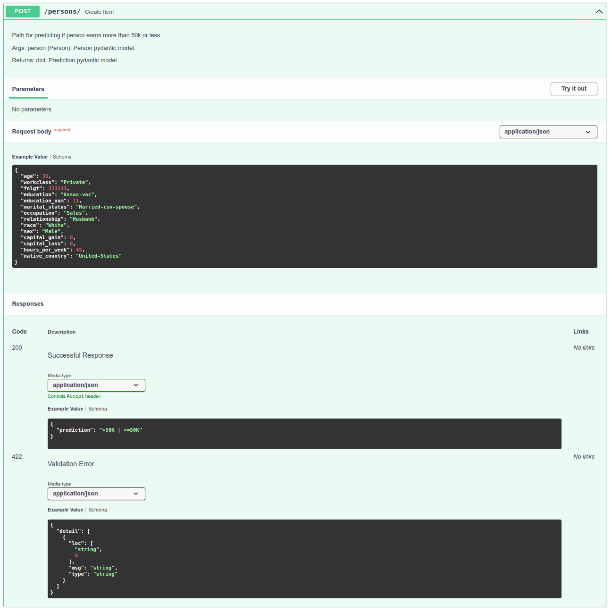

# Full pipeline for ML project - from cleaning data to deploying ML model

## Quick Local Set up

### Using conda environment (version of conda - `4.14.0` and python - `3.9.13`)

Create environment using `environment-dev.yml` file
```bash
conda env create -f environment-dev.yml
conda activate full-pipeline-project
```

### Setting up DVC

The remote (in `.dvc/config` file) is set up to be `gdrive://12xw1Ayk8VwRw8nlhWmYg6vFMe3PlRhoc` which is my personal Google Drive. You need to set up your own remote and create service account in Google Cloud. You can read more [here](https://dvc.org/doc/user-guide/setup-google-drive-remote). Get your own [service account](https://dvc.org/doc/user-guide/setup-google-drive-remote#using-service-accounts) and save the JSON account key in `.gdrive/` folder as follows:


The contents of the JSON file should something like as follows:



You can use this key to log in to your DVC account. Read more on [how to setup Google Drive remote using service account](https://dvc.org/doc/user-guide/setup-google-drive-remote#using-service-accounts).

Details on the data source can be [read here](src/readme-data.md). Acquire the raw data, save it under `src/data/census.csv`, and add it to DVC tracking:
```bash
dvc add src/data/census.csv
```

Once you have set up your DVC, run following to reproduce the whole pipeline:
```bash
dvc repro
```

#### Note
DVC requires Git repository set up in the working folder, so you should have git repository initiated in the working folder.

## Git Actions - simple Continious Integration
The action for CI can be found at `.github/workflows/python-lint-pytest.yml`. This action checks for PEP8 correspondence and runs any PyTest tests. It uses the [DVC workflow](https://github.com/iterative/setup-dvc) to download clean data and model to run the tests.

### Note
The environment variable `GDRIVE_CREDENTIALS_DATA` stores the GDrive account key in JSON format and is used for authentification for DVC. Read more [here](https://dvc.org/doc/user-guide/setup-google-drive-remote#authorization)

## Data
Read how to get the raw data in [`readme-data.md`](src/readme-data.md).

## DVC stages

The DAG looks as follows:



More on the DVC stages can be found in `dvc.yaml` and `params.yaml` file. 

### Clean data
Takes in raw data in `csv` format and saves clean data in `src/data/` folder.

### Check data
Performs simple assertion tests for the clean data.

### Split data
Splits the data into train and test splits, and saves the output to `src/data/` folder.

### Train model
Creates model on train data using by splitting train data to train-validation sets. Outputs model pipeline and saves it into `src/model/` folder.

### Evaluate model
Evaluates model on test data, and also computes scores on slices and saves metrics and plots to `src/metrics/` folder.

## Model

The model is trained at `train_model` stage. Details can be found under `src/train_model/` folder.

### EDA

EDA can be accessed in the [following notebook](src/eda/EDA.ipynb). According to the baseline scores, the best performing model is CatBoost Classifier from Yandex, but due to ETL specifics of this model, we stick to Gradient Boosting Classifier.

### Model specifics

It is simple Gradient Boosting Classifier from scikit-learn packages with default parameters. Some preprocessing has been done and can be accessed in the [notebook](src/eda/EDA.ipynb) as well as in the `src/train_model/ml/data.py` file.

## API Creation

The API is simple RESTful API using FastAPI that implements:
* GET on the root - `/` - giving a welcome message.


* POST on the following path - `/persons/` - that does model inference.


* The details of the API paths can be acccessed through - `/docs` - path.


# API Deployment
* Create a free Heroku account (for the next steps you can either use the web GUI or download the Heroku CLI).
* Create a new app and have it deployed from your GitHub repository.
    * Enable automatic deployments that only deploy if your continuous integration passes.
    * Hint: think about how paths will differ in your local environment vs. on Heroku.
    * Hint: development in Python is fast! But how fast you can iterate slows down if you rely on your CI/CD to fail before fixing an issue. I like to run flake8 locally before I commit changes.
* Write a script that uses the requests module to do one POST on your live API.

## Notes

The server serves microframeworks and frameworks. Server can serve both static and dynamic data generated by apps. Frameworks on the other make it easier to write an app and automate the overhead associated with common activities performed in web development, like routing, templating, ORM, session, etc.


```bash
pip install -U dvc[gdrive] pydrive2
```
### Using DVC

DVC will be used for data versioning and experiment management through pipelines.

Stages:
* Data cleaning - `clean_data`
* Data checking - `check_data`
* Data splitting - `split_data`
* Model training with parameters - `train_model`
    * Implement pipeline model rather than pure model - to do
* Model evaluation - `evaluate_model`
### API creation

Create

### API deployment

pass
