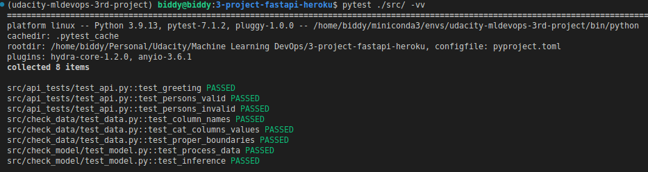
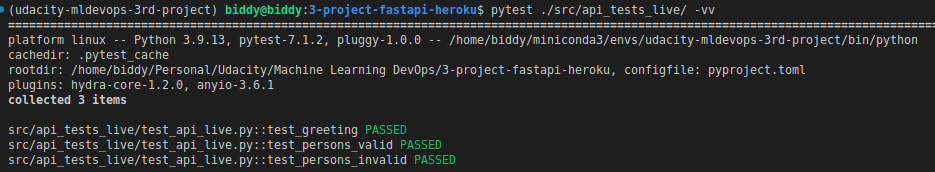
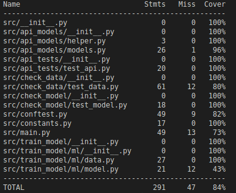
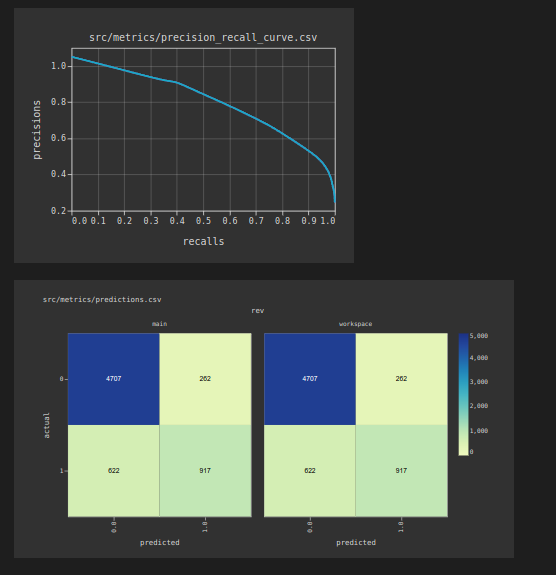

# Project structure

```bash
📦path/to/project
 ┣ 📂.dvc                           # DVC configuration folder
 ┃ ┣ 📄.gitignore
 ┃ ┗ 📄config
 ┣ 📂.github                        # GitHub actions folder
 ┃ ┗ 📂workflows
 ┃   ┗ 📄python-lint-pytest.yml     # Github actions for PEP8 and pytest checks
 ┣ 📂src                            # Source files
 ┃ ┣ 📂api_models                   # Definitions of API models
 ┃ ┃ ┣ 🐍__init__.py
 ┃ ┃ ┣ 🐍helper.py
 ┃ ┃ ┗ 🐍models.py
 ┃ ┣ 📂api_tests                    # API tests
 ┃ ┃ ┣ 🐍__init__.py
 ┃ ┃ ┗ 🐍test_api.py
 ┃ ┣ 📂check_data                   # Tests for clean data (part of DVC stages)
 ┃ ┃ ┣ 🐍__init__.py
 ┃ ┃ ┗ 🐍test_data.py
 ┃ ┣ 📂check_model                  # Tests for model pipeline and functions
 ┃ ┃ ┣ 🐍__init__.py
 ┃ ┃ ┗ 🐍test_model.py
 ┃ ┣ 📂clean_data                   # Data cleaning folder (part of DVC stages)
 ┃ ┃ ┣ 🐍__init__.py
 ┃ ┃ ┣ 🐍clean_data.py
 ┃ ┃ ┗ 🐍helper.py
 ┃ ┣ 📂data                         # Folder to hold data
 ┃ ┃ ┣ 📄.gitignore
 ┃ ┃ ┗ 📄census.csv.dvc
 ┃ ┣ 📂eda                          # Folder for EDA of clean data and model ETL, EDA, and metrics check
 ┃ ┃ ┗ 🐍EDA.ipynb
 ┃ ┣ 📂evaluate_model               # Model evaluation folder for main metrics and slices (part of DVC stages)
 ┃ ┃ ┣ 🐍__init__.py
 ┃ ┃ ┗ 🐍evaluate_model.py
 ┃ ┣ 📂metrics                      # Folder to hold metrics data
 ┃ ┃ ┗ 📄.gitignore
 ┃ ┣ 📂model                        # Folder to hold model
 ┃ ┃ ┗ 📄.gitignore
 ┃ ┣ 📂screenshots                  # Screenshots
 ┃ ┃ ┣ 📄.gitignore
 ┃ ┃ ┣ 🖼️ap-root-path.png
 ┃ ┃ ┣ 🖼️api-persons-path.png
 ┃ ┃ ┣ 🖼️coverage-report.png
 ┃ ┃ ┣ 🖼️dvc-dag.png
 ┃ ┃ ┣ 🖼️dvc-studio-metrics.png
 ┃ ┃ ┣ 🖼️dvc-studio-plots.png
 ┃ ┃ ┣ 🖼️gdrive-json-key.jpg
 ┃ ┃ ┣ 🖼️gdrive-service-account.jpg
 ┃ ┃ ┣ 🖼️git-actions-secret.png
 ┃ ┃ ┣ 🖼️heroku-key.png
 ┃ ┃ ┣ 🖼️tests-general.png
 ┃ ┃ ┗ 🖼️tests-live-api.png
 ┃ ┣ 📂split_data                   # Folder to split the data (part of DVC stages)
 ┃ ┃ ┣ 🐍__init__.py
 ┃ ┃ ┗ 🐍split_data.py
 ┃ ┣ 📂train_model                  # Folder to train the model (part of DVC stages)
 ┃ ┃ ┣ 📂ml                         # Folder to hold model helper functions
 ┃ ┃ ┃ ┣ 🐍__init__.py
 ┃ ┃ ┃ ┣ 🐍data.py
 ┃ ┃ ┃ ┗ 🐍model.py
 ┃ ┃ ┣ 🐍__init__.py
 ┃ ┃ ┗ 🐍train_model.py
 ┃ ┣ 📄README-deployment.md         # Information on the deployment
 ┃ ┣ 📄README-model-card.md         # Model card
 ┃ ┣ 📄README-data.md               # Information on the data
 ┃ ┣ 📄README.md                    # Information on the source code
 ┃ ┣ 🐍__init__.py
 ┃ ┣ 🐍check_api_live.py            # Test live API
 ┃ ┣ 🐍conftest.py                  # PyTest fixtures
 ┃ ┣ 🐍constants.py                 # Module to hold constants
 ┃ ┣ ❗environment-dev.yml          # Conda environment definition for DEV mode
 ┃ ┣ 🐍main.py                      # Main script to start the API
 ┃ ┣ 📄requirements-dev.txt         # Python packages for DEV mode
 ┃ ┣ 📄requirements-test.txt        # Python packages for TEST mode
 ┃ ┗ 🐍sanitycheck.py               # Some tests
 ┣ 📄.dvcignore                     # DVC files to ignore
 ┣ 📄.gitignore                     # GIT files to ignore
 ┣ 📄Aptfile                        # Apt file for Heroku to use
 ┣ 📄LICENSE.txt                    # License
 ┣ 📄Procfile                       # Main command to run for Heroku
 ┣ 📄README-structure.md            # Structure of this project
 ┣ 📄README.md                      # Main README file
 ┣ ❗dvc.lock                       # DVC lock file
 ┣ ❗dvc.yaml                       # DVC stages definition
 ┣ ❗params.yaml                    # Parameters to use for DVC
 ┣ 📄pyproject.toml                 # Python project configuration
 ┣ 📄requirements.txt               # Production environment packages
 ┗ 📄runtime.txt                    # Python runtime version for Heroku to use
```

## Tests

Configuration for the tests is at `src/conftest.py`.

* `src/api_tests/` - tests for the API.
* `src/check_data/` - tests for clean data.
* `src/check_model/` - tests for model pipeline functions.
* `src/check_api_live.py` - tests for live API (not part of the default PyTest tests).

In order to run the general tests, type following `pytest ./src/ -vv`:



In order to test the live API, type following `pytest ./src/api_tests_live/ -vv`:



### Note

Specify your own project URL in `src/api_tests_live/test_api_live.py` in `URL_TO_TEST` variable.

## Test coverage

Run the following to get the report on the test coverage:
```bash
coverage run -m pytest . -vv
coverage report
```



## DVC studio for metrics

Access the DVC metrics and plots through this [link](https://studio.iterative.ai/user/biddy1618/projects/udacity-mldevops-3-project-mlmodel-fastapi-heroku-vja0jevasy)

Metrics as follows:


Plots as follows:




