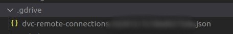
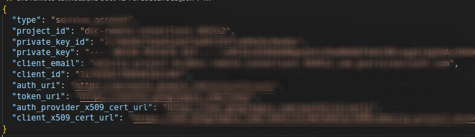
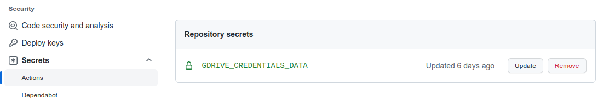
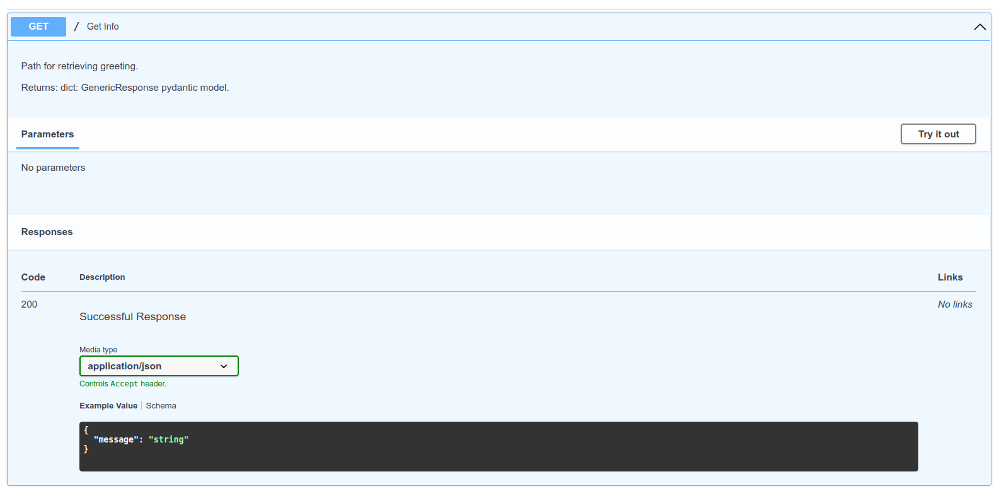
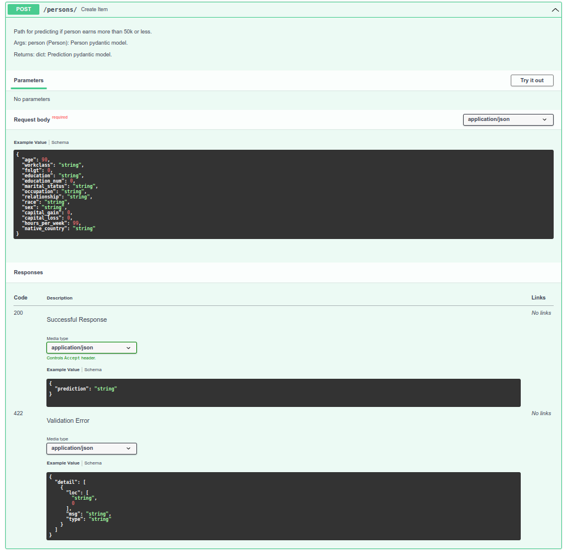

# Full pipeline for ML project - from cleaning data to deploying ML model

## Quick Local Set up

### Using conda environment (version of conda - `4.14.0` and python - `3.9.13`)

Create environment using `src/environment-dev.yml` file
```bash
conda env create -f environment-dev.yml
conda activate full-pipeline-project
```

### Setting up DVC

The remote (in `.dvc/config` file) is set up to be `gdrive://12xw1Ayk8VwRw8nlhWmYg6vFMe3PlRhoc` which is my personal Google Drive. You need to set up your own remote and create service account in Google Cloud. You can read more [here](https://dvc.org/doc/user-guide/setup-google-drive-remote). Get your own [service account](https://dvc.org/doc/user-guide/setup-google-drive-remote#using-service-accounts) and save the JSON account key in `.gdrive/` folder as follows:



The contents of the JSON file should something like as follows:



You can use this key to log in to your DVC account. Read more on [how to setup Google Drive remote using service account](https://dvc.org/doc/user-guide/setup-google-drive-remote#using-service-accounts).

Details on the data source can be [read here](src/README-data.md). Acquire the raw data, save it under `src/data/census.csv`, and add it to DVC tracking:
```bash
dvc add src/data/census.csv
```

Once you have set up your DVC, run following to reproduce the whole pipeline:
```bash
dvc repro
```

#### Note
DVC requires Git repository set up in the working folder, so you should have git repository initiated in the working folder.


### Start the FastAPI framework using Uvicorn server locally

After you've set up environment and DVC, start the server by:
```bash
python -m uvicorn src.main:app --reload
```

You should be able to access the API through localhost.

## Git Actions - simple Continious Integration
The action for CI can be found at `.github/workflows/python-lint-pytest.yml`. This action checks for PEP8 correspondence and runs any PyTest tests. It uses the [DVC workflow](https://github.com/iterative/setup-dvc) to download clean data and model to run the tests.

### Add `GDRIVE_CREDENTIALS_DATA` variable in secrets actions

Add [Google Drive JSON account key](https://dvc.org/doc/user-guide/setup-google-drive-remote#using-service-accounts) to the secrets in the GitHub repo settings:



### Note
The environment variable `GDRIVE_CREDENTIALS_DATA` stores the GDrive account key in JSON format and is used for authentification for DVC. Read more [here](https://dvc.org/doc/user-guide/setup-google-drive-remote#authorization)

## Data
Read how to get the raw data in [`README-data.md`](src/README-data.md).

## DVC stages

The DAG looks as follows:


More on the DVC stages can be found in `dvc.yaml` and `params.yaml` file. 

### Clean data
Takes in raw data in `csv` format and saves clean data in `src/data/` folder.

### Check data
Performs simple assertion tests for the clean data.

### Split data
Splits the data into train and test splits, and saves the output to `src/data/` folder.

### Train model
Creates model on train data using by splitting train data to train-validation sets. Outputs model pipeline and saves it into `src/model/` folder.

### Evaluate model
Evaluates model on test data, and also computes scores on slices and saves metrics and plots to `src/metrics/` folder.

## Model

The model is trained at `train_model` stage. Details can be found under `src/train_model/` folder.

### EDA

EDA can be accessed in the [following notebook](src/eda/EDA.ipynb). According to the baseline scores, the best performing model is CatBoost Classifier from Yandex, but due to ETL specifics of this model, we stick to Gradient Boosting Classifier.

### Model specifics

It is simple Gradient Boosting Classifier from scikit-learn packages with default parameters. Some preprocessing has been done and can be accessed in the [notebook](src/eda/EDA.ipynb) as well as in the `src/train_model/ml/data.py` file.

Model card can be found at [`src/README-model-card.md`](src/README-model-card.md)

## API Creation

The API is simple RESTful API using FastAPI that implements:
* GET on the root - `/` - giving a welcome message.


* POST on the following path - `/persons/` - that does model inference.


* The details of the API paths can be acccessed through - `/docs` - path.

Full API implementation can be seen at [`src/main.py`](src/main.py) file. Models are defined in `src/api_model/` folder.

## API Deployment

App is deployed using Heroku service on free dynos and can be accessed at [__https://dauren-test-project.herokuapp.com__](https://dauren-test-project.herokuapp.com/). No front-end has been implemented.

Details on the API deployment using heroku can be found at this [markdown file](src/README-deployment.md).

## More details

For more details on project structure, test coverage, metrics and plots, access [`README-project.md`](README-project.md)