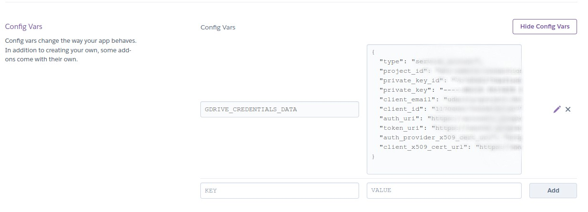

# Deployment on Heroku

## Install heroku

Install the Heroku CLI. I used the Ubunutu installation instructions: `curl https://cli-assets.heroku.com/install.sh | sh`.

To create an app with a specific name and to specify it as Python app use: `heroku create name-of-the-app --buildpack heroku/python`.

## Add `GDRIVE_CREDENTIALS_DATA` variable

Add [Google Drive JSON account key](https://dvc.org/doc/user-guide/setup-google-drive-remote#using-service-accounts) to the configuration variables in the Heroku app settings:



## Project files

* Create `Profile` with the command you want to run. Here I am using uvicorn server to start the API: `web: uvicorn src.main:app --host=0.0.0.0 --port=${PORT:-5000}`.
* Create `requirements.txt` and `runtime.txt` to specify the packages needed to install and Python version.
* We need to give Heroku the ability to pull in data from DVC upon app start up.
    * We will install a [buildpack](https://elements.heroku.com/buildpacks/heroku/heroku-buildpack-apt) that allows the installation of apt-files and then define the Aptfile that contains a path to DVC. I.e., in the CLI run: `heroku buildpacks:add --index 1 heroku-community/apt`.
    * Create `Aptfile` with correct artifact that specifies the release of DVC you want installed, e.g. `https://github.com/iterative/dvc/releases/download/2.23.0/dvc_2.23.0_amd64.deb`.
 
* Add the following code block to `scr/main.py`:
```python
import os

if "DYNO" in os.environ and os.path.isdir(".dvc"):
    os.system("dvc config core.no_scm true")
    if os.system("dvc pull --remote gdrive train_model") != 0:
        exit("dvc pull failed")
    os.system("rm -r .dvc .apt/usr/lib/dvc")
```

You should be good to go.
